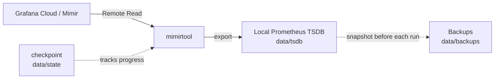
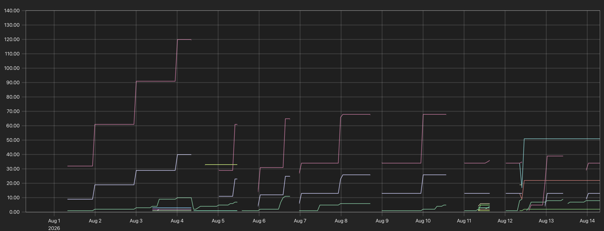
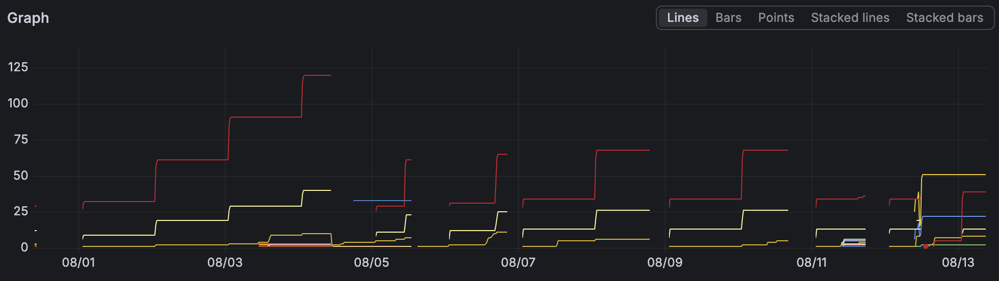

# grafana-metrics-archive

Incrementally pull your **Grafana Cloud (Mimir)** metrics down to a **local Prometheus TSDB**, so you keep a permanent copy of data that would otherwise expire when Grafana Cloud's retention window rolls over.

Grafana Cloud's free/standard retention is limited (two weeks in our case). This project runs [`mimirtool remote-read export`](https://grafana.com/docs/mimir/latest/manage/tools/mimirtool/) on a schedule, walks forward from a saved checkpoint in bounded time windows, and appends new Prometheus blocks to a local archive. The result is a real TSDB you can open with any Prometheus instance.

## How it works



On every run, `archive.sh` (inside the container):

1. **Initializes a checkpoint** on the first run, starting `INITIAL_LOOKBACK_SECONDS` in the past.
2. **Backs up** the current `tsdb/` and `state/` into `data/backups/<timestamp>/`.
3. **Exports forward** from the checkpoint up to `now - LAG_SECONDS`, in chunks of `WINDOW_SECONDS`.
4. **Advances the checkpoint** only after each chunk succeeds, so an interrupted run resumes exactly where it left off.

Bounded windows keep each Remote Read request small, which matters when catching up after days of downtime and avoids known issues with very large exports.

## Repository layout

| Path | Purpose |
| --- | --- |
| [archive.sh](archive.sh) | The incremental export script (container entrypoint). |
| [daily-archive.sh](daily-archive.sh) | macOS: self-scheduling launcher that runs the archiver in a visible window at 09:55. |
| [Dockerfile](Dockerfile) | Builds a small Alpine image bundling `mimirtool`. |
| [compose.yaml](compose.yaml) | Runs the archiver with your `.env` and `./data` volume. |
| [prometheus.yml](prometheus.yml) | Minimal config for inspecting the archive with Prometheus. |
| [Write-up.md](Write-up.md) | Full step-by-step walkthrough, including how it was built and tested. |
| `data/` | Local archive: `tsdb/`, `state/checkpoint`, `backups/` (git-ignored). |

## Prerequisites

- Docker with Docker Compose
- A Grafana Cloud stack with a Prometheus/Mimir data source
- A read-only access policy token with the `metrics:read` scope

## Setup

### 1. Gather your Grafana Cloud values

From your stack's **Prometheus** card → **Details**:

- **Remote Write Endpoint**, e.g. `https://prometheus-prod-XX-prod-eu-west-2.grafana.net/api/prom/push`. Strip `/api/prom/push` to get your `MIMIR_ADDRESS` host.
- **Username / Instance ID** — this is your `MIMIR_TENANT_ID`.

Then create a read-only token: **Access Policies** → **New access policy** → enable **Read** for **Metrics** (`metrics:read`) → **Add token**. Copy it immediately; it becomes `MIMIR_API_KEY`.

### 2. Create your `.env`

```sh
touch .env
chmod 600 .env
```

```dotenv
MIMIR_ADDRESS=https://prometheus-prod-XX-prod-eu-west-2.grafana.net
MIMIR_TENANT_ID=...
MIMIR_API_KEY=...

SELECTOR={__name__=~".+"}

# Config
LAG_SECONDS=600           # 10 minutes: stay behind "now" to avoid partial scrapes
INITIAL_LOOKBACK_SECONDS=1123200  # 13 days: how far back the first run starts
WINDOW_SECONDS=21600      # 6 hours: max range per export request
```

> **Note**
> `.env` and `data/` are git-ignored. Never commit your token.

### 3. Build

```sh
docker compose build
```

## Usage

### First run (start small)

Before backfilling many days, prove the pipeline with a tiny lookback. Temporarily set `INITIAL_LOOKBACK_SECONDS=3600` (1 hour) in `.env`, then:

```sh
docker compose up
```

You should see it create a backup, export one chunk, and advance the checkpoint.

### Full backfill

For a clean real archive, reset the local data and restore the full lookback:

```sh
docker compose down
rm -rf data                      # only if you want a fresh start
# set INITIAL_LOOKBACK_SECONDS back to 1123200 in .env
docker compose up
```

It progresses in six-hour pieces from the lookback point up to `now - LAG_SECONDS`, checkpointing after each.

### Running on a schedule

Run the container periodically (e.g. via `cron` or a scheduler) with `docker compose up`. Each run resumes from the saved checkpoint and only fetches what's new, so overlapping downtime is handled automatically. Runs are idempotent and exit early if the archive is already caught up.

#### macOS: a visible daily run

[daily-archive.sh](daily-archive.sh) schedules the archiver on macOS via a `launchd` LaunchAgent that fires every day at **09:55**. If the laptop is asleep or off at that time, the missed run happens as soon as it wakes.

Just run it once to schedule itself:

```sh
./daily-archive.sh
```

When the schedule fires, a new Terminal window pops up, counts down 5 seconds (ignoring input), runs `docker compose up` with visible output, and stays open until you close it.

```sh
./daily-archive.sh status     # is it scheduled?
./daily-archive.sh run        # open the window now (test it)
./daily-archive.sh uninstall  # remove the schedule
```

> **Important**
> Only one process should touch the TSDB directory at a time. Don't run the archiver while a Prometheus instance is reading the same `data/tsdb`.

## Inspecting the archive

Analyze the TSDB with `promtool` (no local Prometheus install needed):

```sh
docker run --rm \
  -v "$PWD/data/tsdb:/archive" \
  --entrypoint /bin/promtool \
  prom/prometheus:latest \
  tsdb analyze /archive
```

Or serve it with Prometheus and query in the UI:

```sh
docker run --rm \
  -p 9090:9090 \
  -v "$PWD/data/tsdb:/prometheus" \
  -v "$PWD/prometheus.yml:/etc/prometheus/prometheus.yml:ro" \
  prom/prometheus:latest \
  --config.file=/etc/prometheus/prometheus.yml \
  --storage.tsdb.path=/prometheus
```

Then open <http://localhost:9090> and query your metrics.

| Local archive | Grafana Cloud |
| --- | --- |
|  |  |

## Configuration reference

| Variable | Description |
| --- | --- |
| `MIMIR_ADDRESS` | Base URL of your Grafana Cloud Prometheus/Mimir host. |
| `MIMIR_TENANT_ID` | Metrics instance ID, used as the Remote Read Basic-Auth username. |
| `MIMIR_API_KEY` | Access policy token with `metrics:read`. |
| `SELECTOR` | PromQL selector for series to export (default: all series). |
| `LAG_SECONDS` | How far behind "now" each run stops, to avoid partial data. |
| `INITIAL_LOOKBACK_SECONDS` | How far back the very first run begins. |
| `WINDOW_SECONDS` | Maximum time range per export request. |

## Resilience

- **Checkpointing** — the checkpoint advances only after a successful export, and is written atomically. Interrupted runs resume cleanly.
- **Backups** — the current archive and state are snapshotted into `data/backups/` before each run.
- **Failure safety** — a failed export leaves the checkpoint untouched and exits non-zero, so nothing is skipped.

For the complete narrative, including how each piece was verified end to end, see [Write-up.md](Write-up.md).

## License

[MIT](LICENSE) © 2026 Werner de Groot
